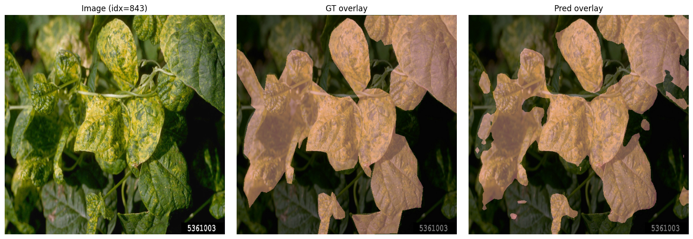
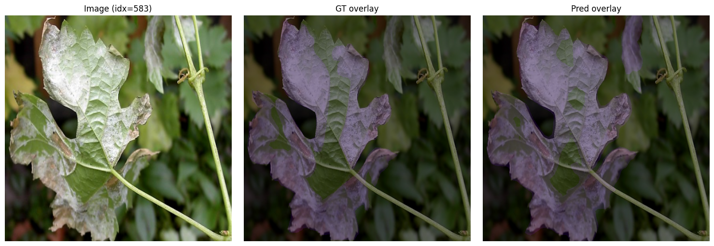

# DL-Final-Project
Source code for NYU Deep Learning Fall 2025 Final Project

Saved example models at [google driver](https://drive.google.com/drive/folders/1Lr_mXebwgJcsOMWS11wtMq_I1cOyqnFy?usp=sharing)

The training, validation, and testing script (all in one notebook)  is updated in the git repo as deeplabv3_resnet101_batch_8.ipynb
We run the experiment in Google Colab, download the script and load in Colab GPU runtime

Recommend to select A100 GPU with 40GB RAM runtime to support high batch size training. 

### Problem Statement

We consider the problem of plant disease semantic segmentation from single RGB images.
Given a high-resolution, close-range image of a plant leaf, the task is to assign a disease class label to each pixel, producing a dense segmentation map that localizes disease regions and distinguishes between different plant–disease categories.

This work focuses on understanding how model backbone choice and training configurations affect segmentation performance when using a modern deep learning framework on a large-scale agricultural dataset.

### Objective and Scope

The primary objective of this project is to systematically evaluate the impact of backbone network choice and training configurations on plant disease segmentation performance.

Scope of this project is limited to empirical analysis and evaluation of existing deep learning models
Specifically, we focus on comparing DeepLabV3 models with different ResNet backbones, including ResNet-50 and ResNet-101, under controlled training conditions.

In addition to backbone comparison, we analyze the effects of key training hyperparameters, such as learning rate, batch size on final performance. This analysis provides practical insights into training stability and performance trade-offs for large-scale plant disease segmentation tasks.

### dataset

We conduct all experiments on the [PlantSeg dataset](https://zenodo.org/records/14935094) , a publicly available large-scale dataset for plant disease semantic segmentation. It consists of high-resolution RGB images of plant leaves with pixel-level
annotations covering multiple disease categories and background. We follow the standard train/validation/test split provided by the dataset. Models are trained on the training set, hyperparameters are selected on the validation set, and final results are reported on the test set. All images are resized to a fixed resolution and normalized using standard RGB normalization prior to training.

### Results

